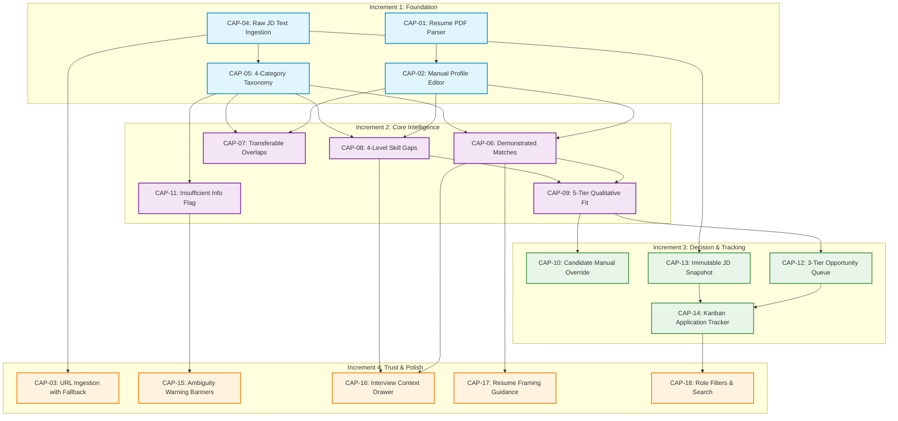

# Product Dependency Roadmap

## Overview

The **Product Dependency Roadmap** maps the architectural, data, and validation prerequisites that govern the delivery order of AI Career Copilot.

In complex AI decision-support systems, feature sequencing is not arbitrary. An advanced capability cannot operate reliably if its foundational data structure or safety guardrail has not been established. This document defines the **critical dependency topology** across all product capabilities.

---

## 1. Dependency Classification Framework

Dependencies are classified into three distinct categories:

```
┌────────────────────────────────────────────────────────────────────────────────────────────────┐
│                                   DEPENDENCY CLASSIFICATION                                    │
├────────────────────────────────────────────────────────────────────────────────────────────────┤
│ 1. HARD (TECHNICAL / DATA) DEPENDENCY                                                          │
│    The downstream capability is mathematically or architecturally impossible without the       │
│    upstream component (e.g., cannot compute skill gaps without structured JD taxonomy).        │
├────────────────────────────────────────────────────────────────────────────────────────────────┤
│ 2. SOFT (UX / WORKFLOW) DEPENDENCY                                                             │
│    The downstream capability can function independently, but its user value and operational    │
│    efficiency are significantly impaired without the upstream component.                       │
├────────────────────────────────────────────────────────────────────────────────────────────────┤
│ 3. VALIDATION (TRUST / SAFETY) DEPENDENCY                                                      │
│    The downstream capability is technologically feasible but MUST NOT BE SHIPPED or scaled     │
│    until an empirical experiment or trust guardrail passes (e.g., AI grounding verification).  │
└────────────────────────────────────────────────────────────────────────────────────────────────┘
```

---

## 2. Product Critical Path Dependency Graph



---

## 3. Comprehensive Capability Dependency Table

| Capability | Module | Depends On (Prerequisites) | Dependency Type | Why the Dependency Exists | Capabilities Unlocked |
| :--- | :--- | :--- | :--- | :--- | :--- |
| **`CAP-01`**: Resume PDF Parsing | Profile | None | — | Entry point for candidate profile generation. | `CAP-02`, `CAP-06`, `CAP-07`, `CAP-08` |
| **`CAP-02`**: Manual Profile Editor | Profile | `CAP-01` | **Hard (Data)** | Candidate must verify and edit parsed profile to eliminate hallucinations. | `CAP-06`, `CAP-07`, `CAP-08` |
| **`CAP-04`**: Raw JD Text Ingestion | Job Capture | None | — | Reliable raw text input bypassing web scrapers. | `CAP-05`, `CAP-13`, `CAP-03` |
| **`CAP-05`**: 4-Category Taxonomy | Job Structuring | `CAP-04` | **Hard (Data)** | AI needs normalized requirements to compare against candidate skills. | `CAP-06`, `CAP-07`, `CAP-08`, `CAP-11` |
| **`CAP-06`**: Demonstrated Matches | Fit Intelligence | `CAP-02`, `CAP-05` | **Hard (Data)** | Requires verified candidate facts and structured JD requirements. | `CAP-09`, `CAP-16`, `CAP-17` |
| **`CAP-07`**: Transferable Overlaps | Fit Intelligence | `CAP-02`, `CAP-05` | **Hard (Data)** | Requires candidate baseline skills and JD tool requirements. | `CAP-09`, `CAP-17` |
| **`CAP-08`**: 4-Level Skill Gaps | Fit Intelligence | `CAP-02`, `CAP-05` | **Hard (Data)** | Requires candidate background to classify missing skills by severity. | `CAP-09`, `CAP-16` |
| **`CAP-09`**: 5-Tier Qualitative Fit | Fit Intelligence | `CAP-06`, `CAP-08` | **Hard (Logic)** | Fit tier synthesis requires both demonstrated matches and gap severity. | `CAP-10`, `CAP-12` |
| **`CAP-11`**: Insufficient-Info Flag | Fit Intelligence | `CAP-05` | **Hard (Data)** | Needs JD parsing output to evaluate completeness of criteria. | `CAP-15` |
| **`CAP-10`**: Fit Manual Override | Fit Intelligence | `CAP-09` | **Hard (UX)** | User must have an AI fit recommendation before overriding it. | User Agency & Trust |
| **`CAP-12`**: 3-Tier Opportunity Queue | Decision Support | `CAP-09` | **Soft (UX)** | Automated triage queue is populated by synthesized fit tiers. | `CAP-14` |
| **`CAP-13`**: Immutable JD Snapshot | Workflow Archive | `CAP-04` | **Hard (Data)** | Preserves exact raw text string ingested in `CAP-04`. | `CAP-14`, Interview Prep |
| **`CAP-14`**: Kanban Application Tracker | Workflow Archive | `CAP-12`, `CAP-13` | **Soft (Workflow)** | Tracker organizes prioritized jobs and links to their snapshots. | `CAP-18`, Longitudinal Data |
| **`CAP-03`**: URL Ingestion + Fallback | Job Capture | `CAP-04` | **Soft (Reliability)** | URL ingestion must fall back to working raw text box upon failure. | Friction Reduction |
| **`CAP-15`**: Incomplete JD Banners | Job Structuring | `CAP-11` | **Soft (UX)** | Renders visual warning banners when `CAP-11` flags missing info. | Candidate Transparency |
| **`CAP-16`**: Interview Prep Drawer | Workflow Depth | `CAP-06`, `CAP-08` | **Hard (Data)** | Generates talking points using exact match and gap data. | Interview Confidence |
| **`CAP-17`**: Resume Framing Guidance | Workflow Depth | `CAP-06`, `CAP-07` | **Hard (Data)** | Maps candidate project evidence to JD requirement gaps. | Application Customization |
| **`CAP-18`**: Target Role Filters | Workflow Archive | `CAP-14` | **Soft (UX)** | Adds multi-dimensional filtering across tracked opportunities. | Search & Retrieval |

---

## 4. Validation Dependencies (Experimentation Gates)

Beyond technical dependencies, the roadmap enforces **empirical validation dependencies** where capability scaling is blocked until specific research gates pass:

```
┌──────────────────────────────────────────────────────────────────────────────────────────────┐
│                              VALIDATION DEPENDENCY GATES                                     │
├──────────────────────────────────────────────────────────────────────────────────────────────┤
│ 1. EXP-01 Validation ──▶ Unlocks Scale Rollout of 5 Qualitative Fit Tiers (`CAP-09`)         │
│    Must prove candidates make higher-confidence decisions vs. numerical match scores.        │
├──────────────────────────────────────────────────────────────────────────────────────────────┤
│ 2. EXP-02 Validation ──▶ Unlocks Full Evidence Citation Layer (`CAP-06`)                     │
│    Must prove verifiable citations increase user trust and trigger active inspection.        │
├──────────────────────────────────────────────────────────────────────────────────────────────┤
│ 3. AI Safety Gate    ──▶ Mandatory Launch Gate for All AI Fit Analysis Components            │
│    Unsupported Evidence (Hallucination) Rate must be strictly < 1.0%.                        │
├──────────────────────────────────────────────────────────────────────────────────────────────┤
│ 4. EXP-03 Validation ──▶ Governs URL Parser Investment vs. Raw Paste Optimization (`CAP-03`) │
│    If URL failure rate > 15%, product maintains Raw Text Paste as primary default UI.        │
├──────────────────────────────────────────────────────────────────────────────────────────────┤
│ 5. EXP-05 Validation ──▶ Unlocks Post-MVP Roadmap Investment                                 │
│    Must demonstrate ≥30% decision-time reduction vs. status quo without decision degradation.│
└──────────────────────────────────────────────────────────────────────────────────────────────┘
```
