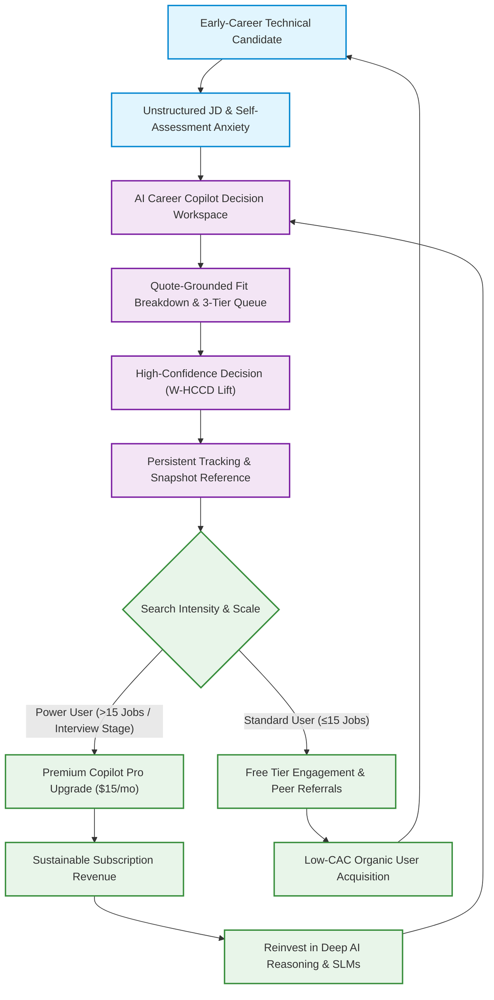
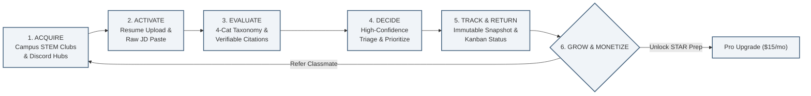

# Phase 9 — Business & Commercial Strategy

## Executive Summary

Phase 9 of the **AI Career Copilot Product Management Case Study** defines the **business model, commercialization strategy, unit economics sensitivity, and go-to-market (GTM) roadmap** for the product.

> **Foundational Governance Notice:**  
> *Commercial viability is an empirical hypothesis to be validated, not an established outcome. There is currently NO verified revenue, paying customer base, user traction, conversion data, retention history, CAC/LTV benchmarks, or commercial contracts. All commercial figures, conversion rates, pricing tiers, and financial projections are analytical planning models labeled `[PLANNING ASSUMPTION]`, `[HYPOTHESIS]`, and `[PRODUCT INFERENCE]`.*

---

## Phase 9 Artifact Navigation

```
09-Business/
├── README.md                      # (This File) Executive overview, business flywheel diagrams & core viability conditions
├── value-proposition.md           # Value Proposition Canvas, customer jobs/pains/gains, and core differentiation
├── customer-segmentation.md       # 5-segment evaluation matrix and technical early-career beachhead selection
├── competitive-positioning.md     # Categorical competitor analysis, comparison matrix, and positioning statement
├── business-model.md              # Evaluation of 5 candidate business models and recommended phased B2C/B2B strategy
├── monetization-strategy.md       # Free vs. Premium tier boundaries, natural upgrade triggers, and pricing experiments
├── go-to-market-strategy.md       # 3-phase GTM roadmap (Community ➔ Content/Referral ➔ University Partnerships)
├── unit-economics-assumptions.md  # SaaS financial model, AI inference COGS breakdown, and 3-scenario sensitivity analysis
├── business-metrics.md            # Commercial telemetry hierarchy, unit economics KPIs, and margin guardrail thresholds
├── business-risks.md              # 8 core business risks (BR-01 to BR-08) with early signals, mitigations, and contingencies
└── business-decision-log.md        # 7 interview-defensible commercial decision records (BD-01 to BD-07)
```

---

## 1. Business Flywheel & Commercial Visualizations

### Diagram 1: Customer Value & Monetization Loop



---

### Diagram 2: User Activation, Decision Quality & Retention Flywheel



---

## 2. Core Commercial Strategy Summary

| Strategic Dimension | Phase 9 Strategic Recommendation | Core Justification |
| :--- | :--- | :--- |
| **Primary Beachhead Customer** | **Final-year STEM students & recent technical graduates** (Data, Business & Product Analysts, ML/SWE). | Dense tool requirements produce maximum evaluation pain; concentrated campus networks enable near-zero CAC. |
| **Primary Value Proposition** | **Evidence-grounded career decision support** that transforms chaotic JDs into quote-cited fit breakdowns. | Solves triage fatigue and qualification self-doubt without resorting to mass-apply spam. |
| **Recommended Business Model** | **Freemium B2C Subscription** (`[HYPOTHESIS]`), with Phase 2 expansion into University B2B Licensing. | Provides immediate feedback velocity and direct student validation before lengthy 12-month university sales cycles. |
| **Pricing Tier Architecture** | **Free:** Complete honest evaluation (5 JDs/wk, 15 stored snapshots).<br/>**Pro ($15/mo):** Unlimited snapshots, STAR interview answer generator, deep GitHub parsing. | Core decision honesty is never paywalled; Premium monetizes workflow depth and interview readiness. |
| **Go-to-Market Distribution** | **Founder/Community-led (Phase 1) ➔ Content/Referral (Phase 2) ➔ University Career Centers (Phase 3).** | Avoids expensive paid ads; leverages high-trust campus workshops and public JD breakdown teardowns. |
| **Unit Economics Benchmark** | **LTV:CAC $\sim 6.15\times$** (Base Case: $\$49.20$ LTV, $\$8.00$ CAC, $82\%$ Gross Margin). | AI inference COGS ($\sim \$1.85/\text{user}/\text{month}$) is comfortably subsidized by $\$15/\text{month}$ subscription. |

---

## 3. Commercial Validation Experiments (Phase 7 Integration)

The commercial strategy defines seven concrete business validation experiments:

| Experiment ID | Focus Area | Tested Hypothesis | Primary Metric | Guardrail | Decision Rule |
| :--- | :--- | :--- | :--- | :--- | :--- |
| **EXP-BIZ-01** | Willingness to Pay | Active job seekers will convert to Pro at $\$15/\text{mo}$ upon hitting storage limit. | Free-to-Paid Conversion ($\ge 4.0\%$) | Paywall Drop-Off ($<20\%$) | If conversion $<2.0\%$, test $\$39$ flat Search Season Pass. |
| **EXP-BIZ-02** | Feature Attribution | STAR interview answer drawer drives higher upgrade intent than raw storage limits. | Upgrade Clicks by Feature Source | Feature Abandonment | Reallocate engineering to feature with $>50\%$ upgrade intent. |
| **GTM-EXP-01** | Campus Activation | Campus STEM club workshops activate students at near-zero CAC. | 48-Hour Activation Rate ($\ge 40\%$) | Workshop Drop-Off | If activation $<15\%$, simplify initial resume onboarding flow. |
| **GTM-EXP-02** | Referral Loops | Candidates will share redacted fit reports with peers ($K$-factor $\ge 0.25$). | Viral Coefficient ($K \ge 0.25$) | User Privacy Complaints | If $K < 0.05$, pivot growth focus from peer invites to public SEO. |
| **GTM-EXP-03** | University B2B | Career Center Deans will pilot the copilot if provided student usage data. | Pilot Agreement Rate ($\ge 30\%$) | Procurement Deadlock | If institutional sales cycle $>15$ mos, keep pure B2C focus. |
| **EXP-BIZ-03** | Search Churn | Average paid subscriber lifetime is $\ge 3.5$ months during an active hiring season. | Monthly Paid Churn ($<28\%$) | Cancellation Feedback | If churn $>40\%$, introduce discounted multi-month pass. |
| **EXP-BIZ-04** | AI Inference COGS | Direct LLM API inference costs remain below $\$2.00$ per active paid user per month. | Inference COGS per Paid User | Latency Inflation | If COGS $> \$3.00$, implement aggressive prompt caching and SLMs. |

---

## 4. Strategic Business Question: "What Must Be True for AI Career Copilot to Become a Viable Business?"

For AI Career Copilot to transition from a validated product concept into a thriving, economically viable commercial enterprise, the following **eight conditions must hold true**:

1. **Meaningful Decision Lift [HYPOTHESIS]:** Candidates must experience tangible, repeatable cognitive relief and decision confidence when evaluating job postings through the copilot compared to status-quo manual browsing and ad-hoc ChatGPT prompts.
2. **Empirical AI Grounding [HYPOTHESIS]:** The AI reasoning engine must maintain an Unsupported Evidence Rate strictly below $1.0\%$; candidate trust collapses permanently if the system hallucinates qualifications.
3. **Organic Acquisition Efficiency [HYPOTHESIS]:** The product must achieve a blended Customer Acquisition Cost (CAC) strictly below $\$10.00$ via organic campus communities, word-of-mouth, and content teardowns, without relying on paid search/social advertising.
4. **Willingness to Pay During Active Search [HYPOTHESIS]:** A viable cohort of active job seekers ($\ge 3.5\text{--}5.0\%$) must find enough value in advanced interview readiness (STAR answers) and workflow depth to pay $\$12\text{--}\$19/\text{month}$ during their 2–5 month search window.
5. **Sustainable AI Inference Margins [HYPOTHESIS]:** Direct LLM inference costs must remain below $\$2.00$ per user/month, yielding gross margins of $75\text{--}85\%$.
6. **Finite Search Monetization Density [HYPOTHESIS]:** Because early-career candidates naturally churn upon securing a job, the business model must generate sufficient revenue within the active search window (or successfully transition candidates to annual alumni/career-development tiers).
7. **Institutional Scalability [HYPOTHESIS]:** University career centers must recognize that evidence-grounded fit tools improve graduate placement outcomes, opening a long-term enterprise B2B SaaS revenue stream.
8. **Preservation of Candidate-First Integrity [HYPOTHESIS]:** The company must resist the temptation of high-dollar employer sourcing fees or auto-apply spam bots, maintaining 100% alignment with candidate outcomes as its ultimate moat.
